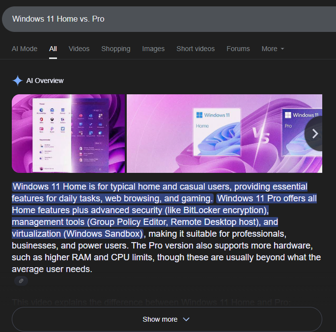
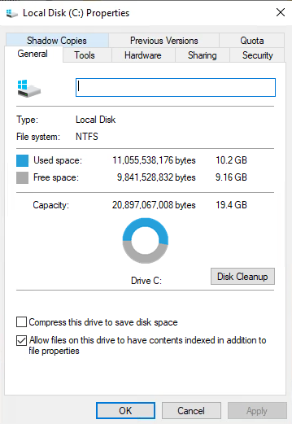
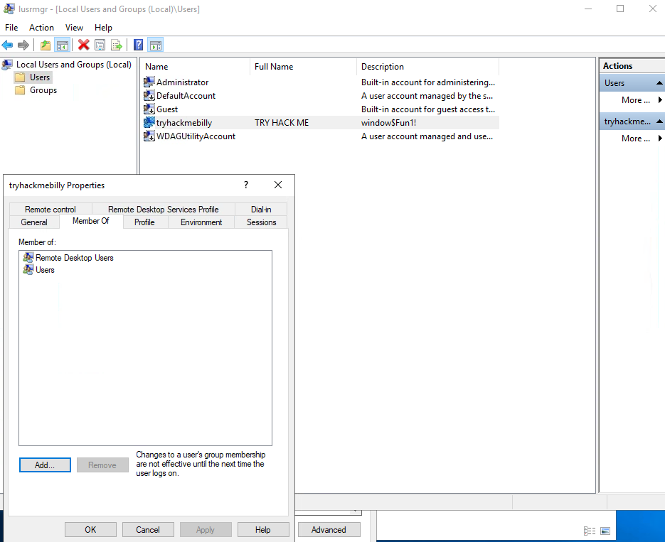
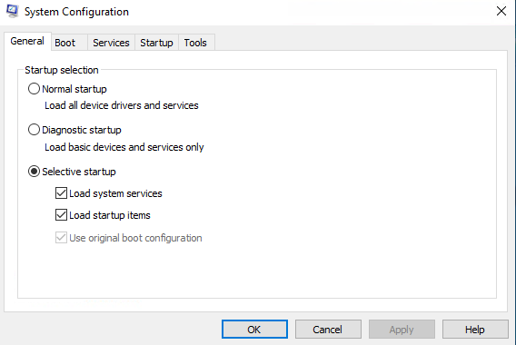
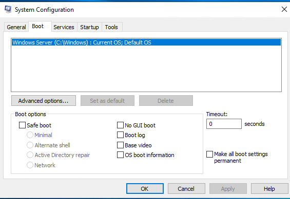
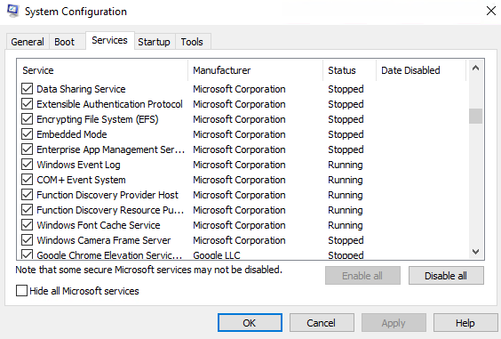
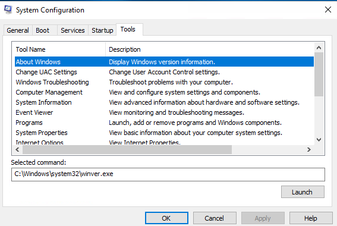
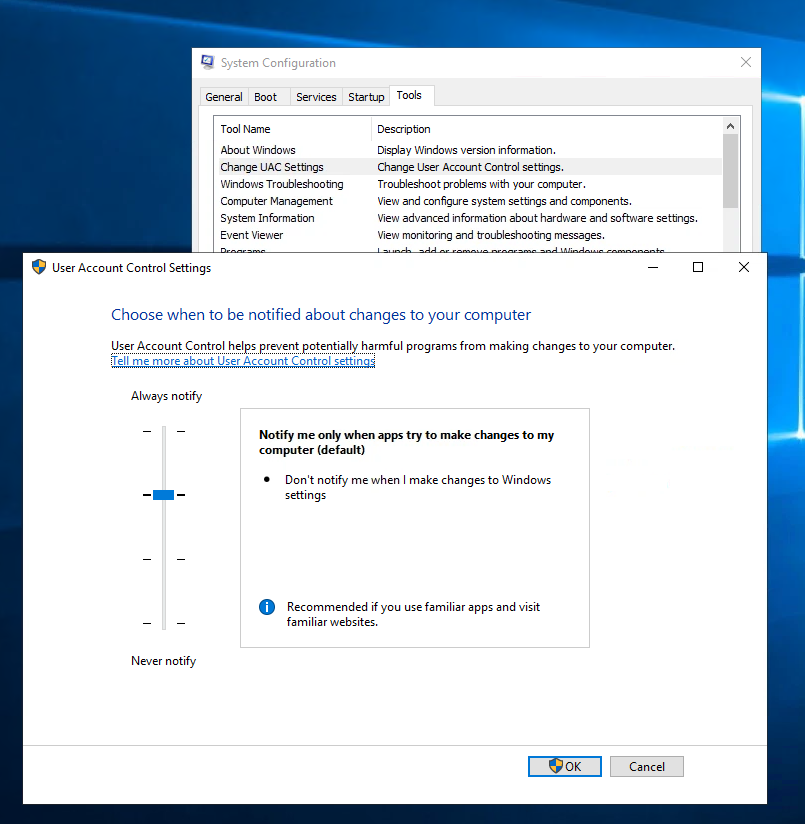
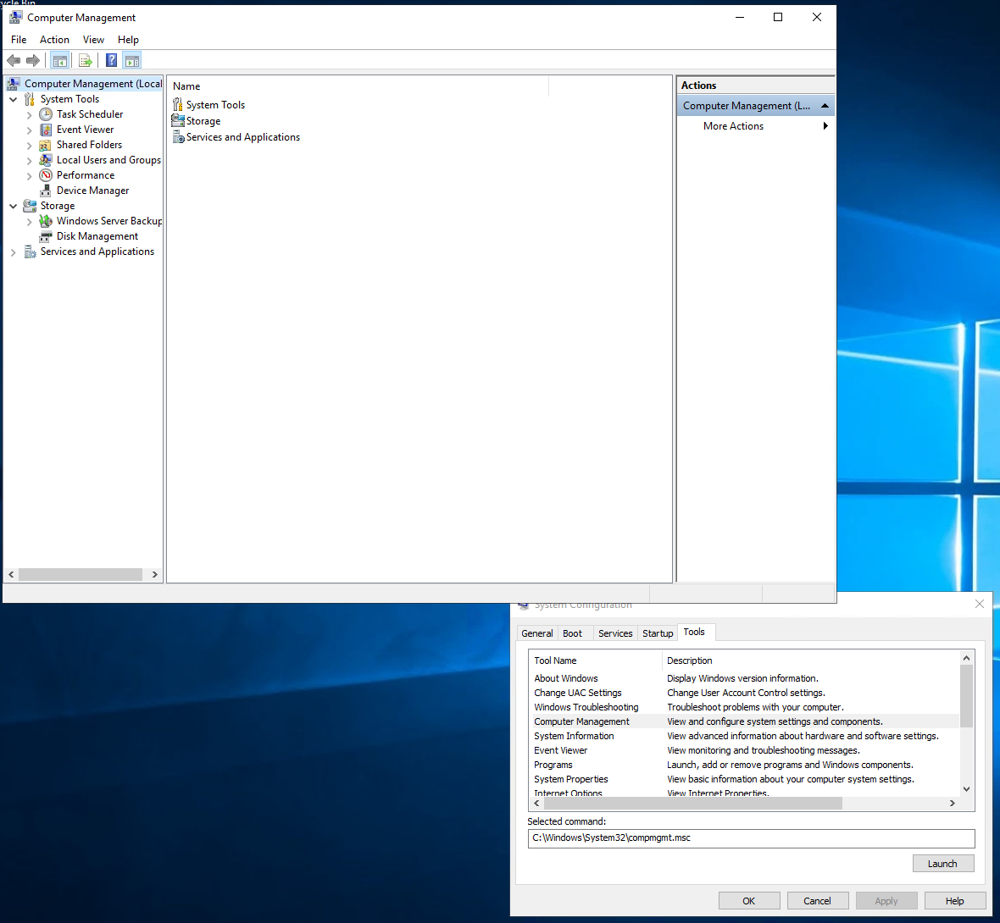
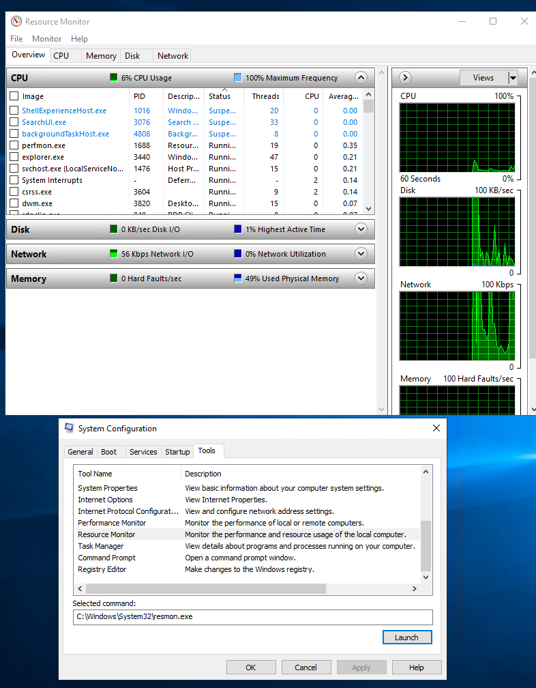

## Room 1: Windows Fundamentals 1

**Note:** Some basic Windows navigation tasks (e.g., Start Menu, Task Manager, Control Panel browsing) were already familiar and are not included.

### Windows Editions
**Action:** Researched Windows 11 editions, comparing different OS versions, and checked System Information to see which version was running.  
**Observation:** Learned about the history and differences between Windows OS versions, including what happened when Windows XP reached end-of-life.  
**Lesson Learned:** Understood the limitations and advantages of different Windows editions. For example, BitLocker is available on Pro but not Home.  

**Screenshots:**  
  

---

### The File System
**Action:** Explored the different file systems supported by Windows and examined how NTFS manages permissions and security features.  
**Observation:** Identified NTFS as the primary Windows file system. Learned what NTFS stands for (New Technology File System) and its key features, such as file permissions, encryption, and compression.  
**Lesson Learned:** Understood how NTFS enforces security through granular access controls, while UAC provides an extra safeguard when administrative privileges are required.  

**Screenshots:**  
  

---

### The Windows\System32 Folder
**Action:** Explored the System32 folder in Windows to understand its contents and purpose.  
**Observation:** This was already familiar, but it reinforced the importance of System32 as it contains critical files for the Windows OS.  
**Lesson Learned:** Although this was a review, it highlighted the need to proceed with extreme caution when working in the System32 folder.  

---

### User Accounts, Profiles, and Permissions
**Action:** Explored Windows and its user management system.  
**Observation:** Learned how to view the properties of each user account within Windows.  
**Lesson Learned:** Although I’m familiar with user management from using Active Directory in my Service Desk role, I realized that these Windows user properties directly correspond to the same concepts I’ve used professionally.  

**Screenshots:**  

---

### User Account Control (UAC)
**Action:** Reviewed how UAC works within Windows.  
**Observation:** This was already familiar, but it reinforced how to manage each user’s access effectively.  
**Lesson Learned:** Although this was a review, it highlighted the importance of granting users only the access they need, rather than full admin rights, which can create security risks.

---

### Conclusion
Overall, this room provided a general overview of the Windows OS. While many tasks were already familiar, it reinforced foundational concepts and introduced new insights, such as NTFS key features and the role of UAC in system security. This lab helped consolidate my understanding of Windows security and administration, laying the groundwork for more advanced labs.

---

## Room 2: Windows Fundamentals 2

**Note:** Some basic tasks, or things I was already familiar with, such as the Command Prompt and Registry Editor have been skipped.

### System Configuration
**Action:** Explored the System Configuration tool in Windows, including its various features and how it helps diagnose startup issues.  

**Observation:** Reviewed each tab:  
- **General:** Specifies the type of startup.  
- **Boot:** Defines different boot options for the OS.  
- **Services:** Lists all services.  
- **Startup:** Managed via Task Manager (somewhat redundant).  
- **Tools:** Provides a list of useful system configuration tools.  

**Lesson Learned:** This was my first time using System Configuration in depth. It will be useful in my role as a Service Desk Analyst for diagnosing startup issues and managing system configurations efficiently.

**Screenshots:**  
  
  
  
  

---

### Change UAC Settings
**Action:** Navigated to User Account Control (UAC) settings via System Configuration.  
**Observation:** Discovered the various levels of UAC available in Windows and what each level controls.  
**Lesson Learned:** Learned how to adjust UAC levels to balance usability and security. This is useful for configuring systems to provide the best protection for different users.

**Screenshots:**  
  

---

### Computer Management
**Action:** Explored the Computer Management tool in Windows to review its various features.  

**Observation:** Examined several sections within Computer Management:  
- **Task Scheduler:** Allows scheduling tasks, such as scripts to clear temporary files automatically.  
- **Event Viewer:** Displays system events, useful for diagnosing issues.  
- **Shared Folders:** Lists all shared folders; the Sessions subsection shows who is connected to each folder.  
- **Local Users and Groups:** Manages user accounts and groups.  
- **Performance Monitor:** Shows real-time system performance, including memory and CPU usage.  
- **Device Manager:** Displays connected hardware devices, from keyboards to monitors and ports.  
- **Disk Management:** Shows connected drives, partitions, and free space.  

**Lesson Learned:** It was helpful to see all these tools consolidated in one interface. While I was familiar with many individually (Event Viewer, Device Manager, Disk Management), I had not previously explored the full Computer Management console.

**Screenshots:**  
  

---

### System Information
**Action:** Explored the System Information tool in Windows to review its features in depth.  
**Observation:** Examined the different sections:  
- **System Summary:** Provides general information about the system, such as processor, memory, and RAM.  
- **Components:** Displays detailed information about hardware devices, including displays, network adapters, storage, and more.  
- **Software Environment:** Offers a deeper view of installed software, system drivers, environment variables, and running tasks. Useful for identifying software-related issues.  
**Lesson Learned:** While I was familiar with the System Summary section, exploring all features highlighted how useful System Information is for understanding a system’s configuration and troubleshooting potential issues.

**Screenshots:**  
  

---

### Resource Monitor
**Action:** Explored the Resource Monitor tool in Windows to review its performance monitoring features.  
**Observation:** Examined its main sections: CPU, Disk, Network, and Memory.  
**Lesson Learned:** Resource Monitor is a valuable tool for viewing system performance. It helps identify which processes or services are consuming resources, making it easier to troubleshoot performance issues when a particular process or service is using excessive CPU, disk, network, or memory.  

**Screenshots:**  
  

---

### Conclusion
Room 2 of Windows Fundamentals built on the basics from Room 1 and introduced more advanced system management tools. I gained hands-on experience with System Configuration, Computer Management, System Information, and Resource Monitor, learning how to diagnose startup issues, monitor performance, and manage users and hardware efficiently. While some sections were familiar, exploring these tools in depth highlighted new features and best practices that will be directly applicable in my role as a Service Desk Analyst, particularly for troubleshooting and system administration tasks.

---

## Room 3: Windows Fundamentals 3

**Note:** All tasks in this room were familiar from previous experience as a Service Desk Analyst. This room served primarily as a refresher on Windows security tools and features.

### Conclusion
Room 3 reinforced my understanding of Windows security and built on knowledge from Rooms 1 and 2. No new tools or concepts were introduced, but it provided a helpful recap of best practices.
