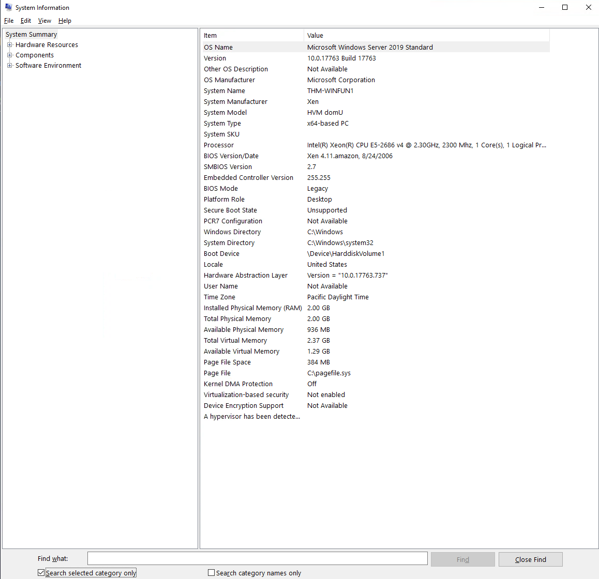
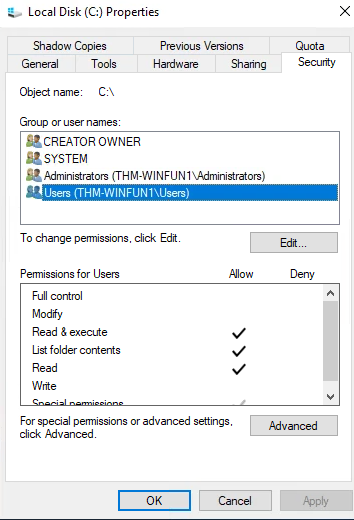

## Room 1: Windows Fundamentals 1

**Note:** Some basic Windows navigation tasks (e.g., Start Menu, Task Manager, Control Panel browsing) were already familiar and are not included in detail.

### Windows Editions
**Action:** Researched Windows 11 editions, comparing different OS versions, and checked System Information to see which version was running.  
**Observation:** Learned about the history and differences between Windows OS versions, including what happened when Windows XP reached end-of-life.  
**Lesson Learned:** Understood the limitations and advantages of different Windows editions. For example, BitLocker is available on Pro but not Home.  

**Screenshots:**  
  

### The File System
**Action:** Explored the different file systems supported by Windows and examined how NTFS manages permissions and security features.  
**Observation:** Identified NTFS as the primary Windows file system. Learned what NTFS stands for (New Technology File System) and its key features, such as file permissions, encryption, and compression.  
**Lesson Learned:** Understood how NTFS enforces security through granular access controls, while UAC provides an extra safeguard when administrative privileges are required.  

**Screenshots:**  
  

### The Windows\System32 Folder
**Action:** Explored the System32 folder in Windows to understand its contents and purpose.  
**Observation:** This was already familiar, but it reinforced the importance of System32 as it contains critical files for the Windows OS.  
**Lesson Learned:** Although this was a review, it highlighted the need to proceed with extreme caution when working in the System32 folder.  

### User Accounts, Profiles, and Permissions
**Action:** Explored Windows and its user management system.  
**Observation:** Learned how to view the properties of each user account within Windows.  
**Lesson Learned:** Although I’m familiar with user management from using Active Directory in my Service Desk role, I realized that these Windows user properties directly correspond to the same concepts I’ve used professionally.  

**Screenshots:**  

### User Account Control (UAC)
**Action:** Reviewed how UAC works within Windows.  
**Observation:** This was already familiar, but it reinforced how to manage each user’s access effectively.  
**Lesson Learned:** Although this was a review, it highlighted the importance of granting users only the access they need, rather than full admin rights, which can create security risks.

### Conclusion
Overall, this room provided a general overview of the Windows OS. While many tasks were already familiar, it reinforced foundational concepts and introduced new insights, such as NTFS key features and the role of UAC in system security. This lab helped consolidate my understanding of Windows security and administration, laying the groundwork for more advanced labs.
