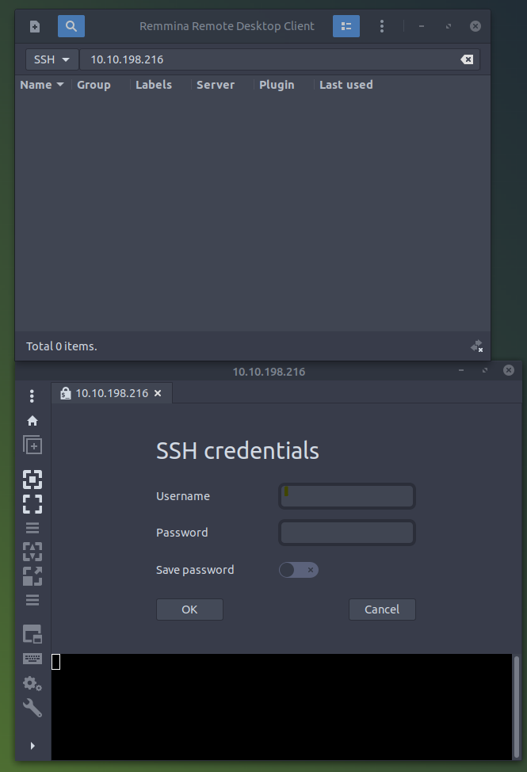
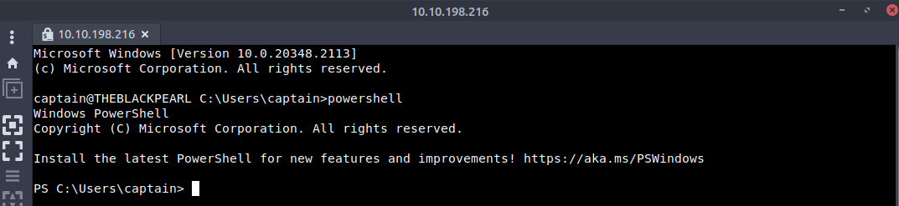
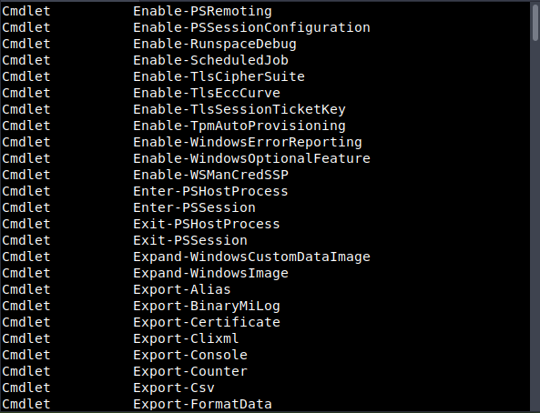
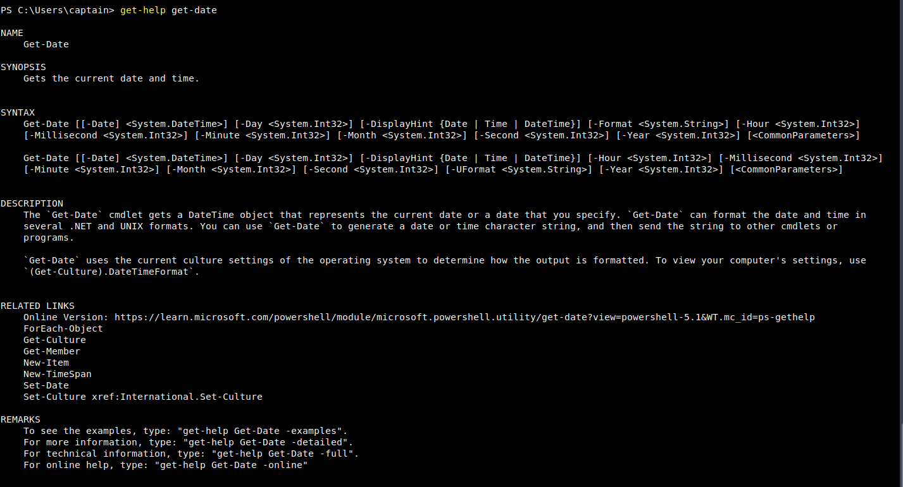
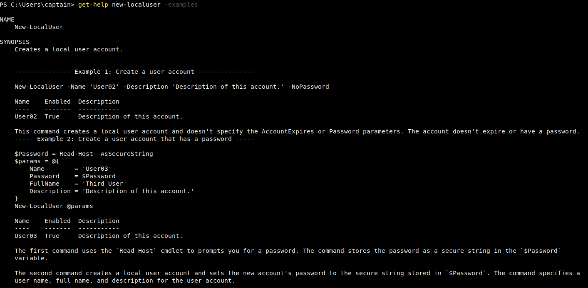
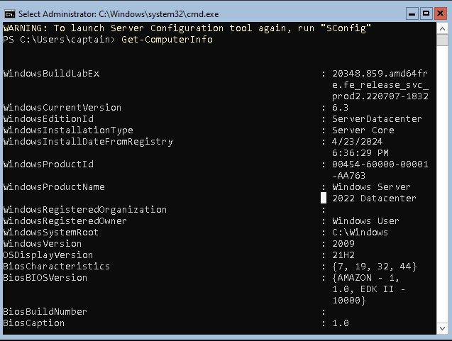
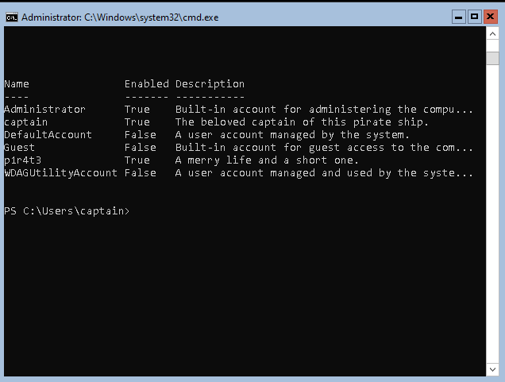
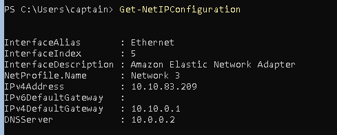
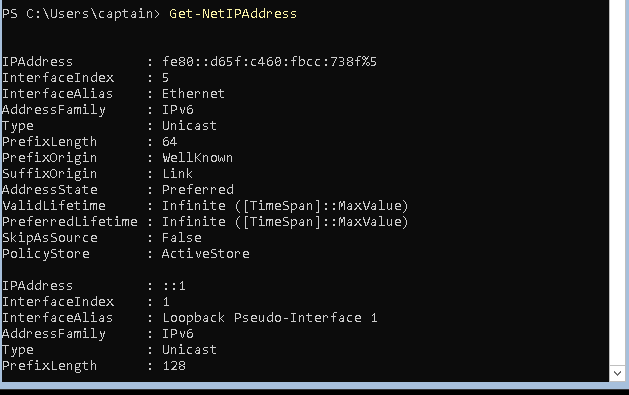
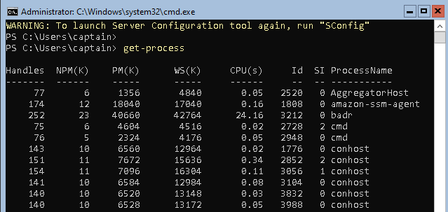

# Windows PowerShell

TryHackMe's Windows PowerShell room. This is part of the 'Cyber Security 101' learning path and the 'Command Line' module.

The room consists of the following tasks:
- Task 1: Introduction
- Task 2: What is PowerShell
- Task 3: PowerShell Basics
- Task 4: Navigating the File System and Working with Files
- Task 5: Piping, Filtering, and Sorting Data
- Task 6: System and Network Information
- Task 7: Real-Time System Analysis
- Task 8: Scripting
- Task 9: Conclusion

## Task 2: What is PowerShell?

### Notes:
- PowerShell is a powerful tool from Microsoft
- Designed for task automation and configuration management
- Combines a command-line interface with a scripting language based on the .NET Framework
- Object-oriented - can handle complex data types and interact with system components effectively
- Initially exclusive to Windows, now expanded to macOS and Linux

- To fully grasp PowerShell's power, understanding objects is essential
- In programming, an object represents an item with properties (characteristics) and methods (actions)
- A 'Car' object might have properties like 'Colour', 'Model', and 'Fuel Level'
- Methods might include 'Drive()', 'HonkHorn()', 'Refuel()'

## Task 3: PowerShell Basics

### Notes:
- In this task, we connect to the target VM via SSH using the Remmina Client

- PowerShell can be launched in several ways, depending on the environment
- Below, we launch it via CMD by typing `PowerShell` and pressing Enter

- PowerShell commands are known as 'cmdlets' - more powerful than traditional Windows commands
- Cmdlets allow for advanced data manipulation

- Cmdlets follow a consistent Verb-Noun naming convention:
  - `Get-Content`: Retrieves file content and displays it in the console
  - `Set-Location`: Changes the current working directory

- Use `Get-Command` to list all available cmdlets, functions, aliases, and scripts
- Essential for discovering available commands

- Filter command lists using `-CommandType` parameter
- Example: `Get-Command -CommandType "Function"` displays only functions

- `Get-Help` provides detailed information about cmdlets, including usage, parameters, and examples
- Append options to retrieve additional information

- PowerShell includes aliases - shortcuts/alternative names for cmdlets
- Example: `echo` is an alias for `Write-Output`

- Use `Find-Module` to search for modules in online repositories
- Use wildcards for partial name searches: `Find-Module -Name "PowerShell*"`
- Install modules using: `Install-Module -Name "PowerShellGet"`

## Task 4: Navigating the File System and Working with Files

### Notes:
- PowerShell provides cmdlets for navigating the file system and managing files
- Many have counterparts in traditional Windows CLI

- `Get-ChildItem` lists files and directories (similar to `dir` in CMD or `ls` in Linux)
- Specify location with the `-Path` parameter
- Without a path, displays current directory contents

- `Set-Location` changes the current directory (similar to `cd` in Command Prompt)
- Example: `Set-Location -Path ".\Documents"`

- `New-Item` creates files or directories
- Specify type with `-ItemType`: `New-Item -Path ".\path-to\folder" -ItemType "Directory"`

- `Remove-Item` removes both directories and files (combines `rmdir` and `del` in CMD)

- `Copy-Item` copies files and directories (equivalent to `copy`)
- `Move-Item` moves files and directories (equivalent to `move`)

- `Get-Content` reads and displays file content (similar to `type` in CMD or `cat` in Linux)

## Task 5: Piping, Filtering, and Sorting Data

### Notes:
- Piping allows output of one command to be used as input for another
- Creates a sequence of operations where data flows between commands
- Represented by the `|` symbol
- Widely used in Windows CLI and Unix-based shells

- PowerShell piping is more powerful because it passes objects rather than just text
- Objects carry data, properties, and methods

- Example: `Get-ChildItem | Sort-Object Length`
- `Get-ChildItem` retrieves files, pipe sends them to `Sort-Object` which sorts by size

- `Where-Object` filters objects based on specific conditions
- Example: `Get-ChildItem | Where-Object Length -gt 100` returns items larger than 100 bytes

- Comparison operators:
  - `-ne`: not equal
  - `-gt`: greater than
  - `-ge`: greater than or equal to
  - `-lt`: less than
  - `-le`: less than or equal to

- `Select-Object` selects specific properties or limits returned objects
- Supports regular expressions
- Example: `Get-ChildItem | Select-Object Name, Length` returns only name and size

## Task 6: System and Network Information

### Notes:
- PowerShell addresses the need for powerful automation and management tools
- Offers cmdlets for retrieving detailed system configuration and network settings

- `Get-ComputerInfo` retrieves comprehensive system information:
  - OS information, hardware specs, BIOS details
  - Provides complete system configuration snapshot
  - Traditional `systeminfo` retrieves only a subset of this information

- `Get-LocalUser` lists all local user accounts
- Displays username, account status, and description
- Useful for user account management and security configuration

- `Get-NetIPConfiguration` provides detailed network interface information:
  - IP addresses, DNS servers, gateway configurations

- `Get-NetIPAddress` provides specific IP address details for network interfaces
- Includes inactive addresses

- These cmdlets enable quick access to crucial system/network information
- Facilitates monitoring and management of local and remote machines

## Task 7: Real-Time System Analysis

### Notes:
- `Get-Process` provides detailed view of running processes
- Includes CPU and memory usage

- `Get-Service` retrieves service status information
- Shows running, stopped, or paused services
- Used by system administrators and forensic analysts to detect anomalous services

- `Get-NetTCPConnection` displays current TCP connections
- Provides insights into local and remote endpoints
- Useful for incident response and malware analysis to detect hidden backdoors

- `Get-FileHash` generates file hashes
- Valuable for incident response, threat hunting, and malware analysis
- Verifies file integrity and detects tampering

## Task 8: Scripting

### Notes:
- Scripting involves writing and executing command sequences in text files
- Automates tasks typically performed manually

- **Blue Team** uses PowerShell scripts for:
  - Log analysis and anomaly detection
  - Extracting indicators of compromise
  - Reverse engineering malicious code
  - Automated intrusion scanning

- **Red Team** uses PowerShell scripts for:
  - System enumeration
  - Executing remote commands
  - Crafting obfuscated scripts to bypass defences
  - Simulating attacks and testing system resilience

- **System Administrators** use scripts for:
  - Automated integrity checks
  - System configuration management
  - Network security enforcement
  - Security policy enforcement and automatic incident response

- `Invoke-Command` executes commands on remote systems
- Enables efficient remote management and automation across multiple machines
- Used by penetration testers and attackers to execute payloads on target systems

## Task 9: Conclusion

### Notes:
This room has provided a foundation for using Windows PowerShell as a powerful command-line and scripting tool. We've moved beyond basic commands to explore its true strength in object-oriented data handling, system administration, and automation.

The skills covered—from navigating the file system and filtering data to retrieving real-time system information and basic scripting—are essential for cybersecurity and IT professionals. Mastering these fundamentals is a critical step toward efficiently managing systems, conducting security analyses, and automating complex tasks.

