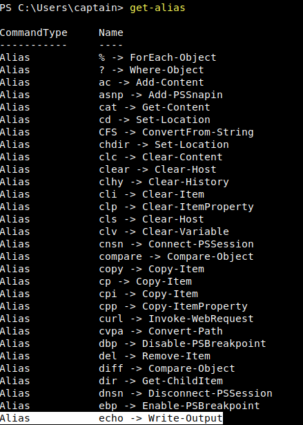

# Windows PowerShell

TryHackMe's Windows PowerShell room. This is part of the 'Cyber Security 101' learning path and is part of the 'Command Line' Module.

It consists of the following Tasks:
Task 1: Introduction
Task 2: What is PowerShell
Task 3: PowerShell Basics
Task 4: Navigating the File System and Working with Files
Task 5: Piping, Filtering, and Sorting Data
Task 6: System and Network Information
Task 7: Real-Time System Analysis
Task 8: Scripting
Task 9: Conclusion

## Task 2: What is PowerShell?

### Notes:
- PowerShell is a powerful tool from Microsoft.
- It is designed for task automation and configuration management.
- Combines a command-line interface + scripting language based on the .NET Framework.
- Object-oriented. Can handle complex data types, interact with system components effectively.
- Initially exclusive to Windows, lately expanded to macOS/Linux

- To fully grasp the power of PowerShell, one needs to understand what an object is in this context.
- In programming, an object represents an item with properties (characteristics) and methods (actions).
- 'Car' object might have properties like 'Colour, Model and Fuel Level'
- Methods like 'Drive(), Honkhorn(), Refuel()'

## Task 3: PowerShell Basics:

### Notes:
- In this task, we will be going over the basics of PowerShell. First, we will be connecting to the target VM via SSH using the Reminna Client

- PowerShell can be launched in several ways, depending on the Environment. Below, we are launching it via CMD, by typing PowerShell and pressing Enter

- PowerShell commands are known as 'cmdlets'. Much more powerful than traditional Windows commands, they allow for more advanced data manipulation.

- Cmdlets follow a consistent Verb-Noun naming convention. For example:
  - 'Get-Content': Retrieves the content of a file and displays it in the console.
  - 'Set-Location': Changes current working directory.

- To list all available cmdlets, functions, aliases, and scripts that can be executed in the current PowerShell session, use 'Get-Command'. Essential for discovering what commands can be used.

  
- We can filter the list of commands. Example, if we want to only display functions, we can use '-CommandType "Function"'

- Another essential cmdlet that is useful is 'Get-Help'. Provides detailed information about cmdlets, including usage, parameters, and examples. It informs us that we can retrieve other useful information by appending options to the syntax.

- PowerShell also includes aliases, which are shortcuts/alternative names for cmdlets. For example, the command 'echo' is an alias of 'Write-Output'

- To search for modules in online repositories, we can use Find-Module. If we don't know exact name, we can search for modules with similar names. We can do this by filtering by 'Name' and using a wildcard. For example, 'Find-Module -Name "PowerShell*'.

- Once the module is identified, you can install it using 'Install-Module -Name "PowershellGet".

## Task 4: Navigating the File System and Working with Files:

### Notes:
- PowerShell provides a range of cmdlets for navigating the file system and managing files. Many have counterparts in traditional Windows CLI.
- Similar to the 'dir' command in CMD (or ls in Linux), 'Get-ChildItem' lists files and directories for the location specified with the '-Path' parameter. Can be used to explore directories and their contexts.
- If no path is specified, it will display the content of the current directory

- Set-Location is similar to the cd command in Command Prompt. It changes the current directory. For example, 'Set-Location -Path ".\Documents' will take you to the documents folder.

- To create an item in PowerShell, we can use 'New-Item'. Will need to specify whether it is a file or a directory. (New-Item -Path ".\path-to\folder" -ItemType "Directory")

- 'Remove-Item' removes both directories and files, a combination of 'rmdir' and 'del' in CMD.

- 'Copy-Item' copies both files and directories (equivalent to copy), and Move-Item moves them (comparable to move).

- Get-Content similar to 'type' in CMD (or cat in Linux), it reads and displays the content of a file.

## Task 5: Piping, Filtering, and Sorting Data:

### Notes:

- Piping is a technique used in command line interfaces. Allows output of one command to be used as input of another.
- Creates a squence of operations where data flows from one command to the next.
- Represented by the | symbol.
- It is widely used in Windows CLI. As well as unix-based shelsls.

- In PowerShell, piping is even more powerful because it passes objects rather than just text. Objects carry not only data, but also properies and methods that describe/interact with data.

- For example, if you want to get a list of files in a directory, and then sort them by size, you could use 'Get-ChildItem | Sort-Object Length'.

- Get-ChildItem retrieves files, pipe sends those files to 'Sort-Object' which sorts them by their 'Length' (size)

- To filter object based on specific conditions, returning only those that meet criteria, we can use 'Where-Object'.
- For example, 'Get-ChildItem | Where-Object Length -gt 100' will return items in current directory with size greater than 100.
  - '-ne' = not equal
  - '-gt' = greater than
  - '-ge- = greater than or equal to
  -  '-lt' = less than
  -  '-le' = less than or equal to
 
- 'Select-Object' is used to select specific properties from objects/limit number of objects returned. Refining the output. It supports the use of regex.
    - For example, 'Get-ChildItem | Select-Object Name, Length' will return just the name and size of a file.

## Screenshots:

## Task 6: System and Network Information:

### Notes:

## Screenshots:

## Task 7: Real-Time System Analysis:

### Notes:

## Screenshots:

## Task 8: Scripting:

### Notes:

## Screenshots:

## Task 9: Conclusion:

### Notes:

## Screenshots:

